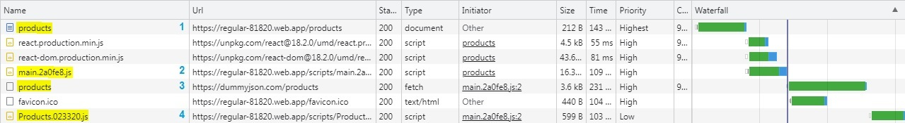
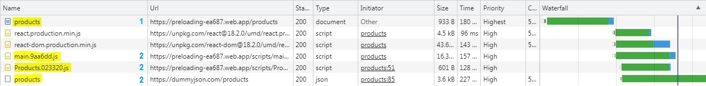

# html-webpack-preload-react-router

A webpack plugin that injects an inline script tag to preload chunks based on react router plain objects and the current URL path. It preloads only the relevant chunks for the current page.

Note: This is an extension plugin for *[html-webpack-plugin](https://github.com/jantimon/html-webpack-plugin)* - a plugin that simplifies the creation of HTML files to serve your webpack bundles.

## Introduction

This plugin aims to reduce page load times by preloading JavaScript and CSS chunks earlier than the traditional approach.

When using React router with code splitting (lazy loading), the traditional page load process is:
1. Downloading and executing the initial HTML file.
2. The HTML fetches and executes only the initial Javascripts and CSS chunks.
3. The react router code examines the current URL path and runs `loader` method if defined.
4. The react router code examines the current URL path and fetching and executing only the relevant chunk files based on `element` property.



Each step occurs in a row and has a network request. It is a waste of time! With this plugin 2nd, 3rd and 4th steps will be parallelized network requests.



## Installation

This plugin requires `html-webpack-plugin` as a peer dependency.

To install the Webpack plugin, use the following command:

```bash
  npm install --save-dev html-webpack-preload-react-router
```

## Configuration

In your `webpack.config.js`, `require()` the plugin as follows:

```js
const ReactRouterPreloadChunksPlugin = require('html-webpack-preload-react-router');
```

Specify the entry route filename as follows:

```js
const entryRouteFilename = path.resolve(`src/pages/entryRoute.route.js`);
```

Finally, add the plugin to your webpack configuration's `plugins` array after `HtmlWebpackPlugin`:

```js
plugins: [
  new HtmlWebpackPlugin({
    scriptLoading: 'module'
  }),
  new ReactRouterPreloadChunksPlugin({
    entryRoute: entryRouteFilename
  })
]
```

## How to use

When utilizing dynamic imports (lazy loading), include the magic comment `webpackChunkName` in every `import()` statement.

For example:

```js
const Home = lazy(()=> import(/* webpackChunkName: 'Home' */ "src/pages/Home"));
```

Additionally, in every route object employ the `chunkName` property with the same name used in `webpackChunkName`.

```diff
export const mainRoutes = [{
+   chunkName: "Home",
    path: "",
    element: <Home />,
//...
}]
```

## Recommendation for an article

I recommend reading my article, *Boost Your Webpage Load Performance with the new Webpack plugin*. It includes an example of using this Webpack plugin and explains how to make your react router plain objects a single source of truth for three different purposes.
